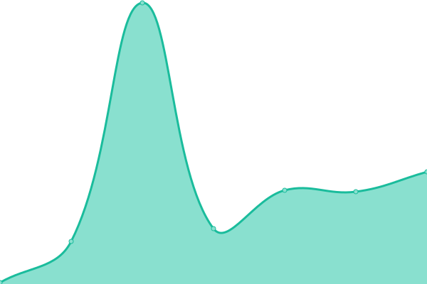

# [📈 Live Status](https://demo.upptime.js.org): <!--live status--> **🟧 Partial outage**

This repository contains the open-source uptime monitor and status page for [nileshsalunke09](https://demo.upptime.js.org), powered by [Upptime](https://github.com/upptime/upptime).

With [Upptime](https://upptime.js.org), you can get your own unlimited and free uptime monitor and status page, powered entirely by a GitHub repository. We use [Issues](https://github.com/nileshsalunke09/Linux-Shell-Scripting/issues) as incident reports, [Actions](https://github.com/nileshsalunke09/Linux-Shell-Scripting/actions) as uptime monitors, and [Pages](https://demo.upptime.js.org) for the status page.

<!--start: status pages-->
<!-- This summary is generated by Upptime (https://github.com/upptime/upptime) -->
<!-- Do not edit this manually, your changes will be overwritten -->
<!-- prettier-ignore -->
| URL | Status | History | Response Time | Uptime |
| --- | ------ | ------- | ------------- | ------ |
|  [Linux-Shell-Scripting](https://nileshsalunke09.github.io/Linux-Shell-Scripting/) | 🟥 Down | [linux-shell-scripting.yml](https://github.com/nileshsalunke09/upptime/commits/HEAD/history/linux-shell-scripting.yml) | 

 82ms
     
 | 

<a href="https://nileshsalunke09.github.io/upptime/history/linux-shell-scripting">100.00%</a>
    

|  [OpenSpecimen_Demo-Site](https://demo.openspecimen.org/) | 🟩 Up | [open-specimen-demo-site.yml](https://github.com/nileshsalunke09/upptime/commits/HEAD/history/open-specimen-demo-site.yml) | 

 262ms
     
 | 

<a href="https://nileshsalunke09.github.io/upptime/history/open-specimen-demo-site">100.00%</a>
    

|  [OpenSpecimen_Test-Site](https://test.openspecimen.org/) | 🟩 Up | [open-specimen-test-site.yml](https://github.com/nileshsalunke09/upptime/commits/HEAD/history/open-specimen-test-site.yml) | 

 239ms
     
 | 

<a href="https://nileshsalunke09.github.io/upptime/history/open-specimen-test-site">100.00%</a>
    

<!--end: status pages-->

[**Visit our status website →**](https://demo.upptime.js.org)

## 📄 License

- Powered by: [Upptime](https://github.com/upptime/upptime)
- Code: [MIT](./LICENSE) © [nileshsalunke09](https://demo.upptime.js.org)
- Data in the `./history` directory: [Open Database License](https://opendatacommons.org/licenses/odbl/1-0/)
